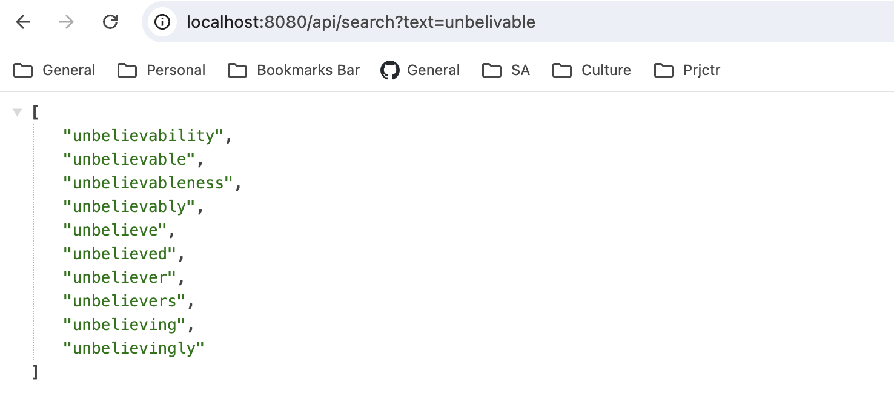
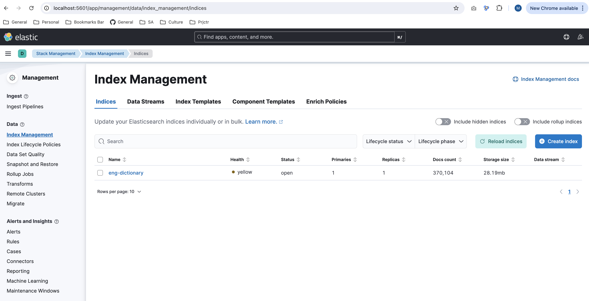

# HSA elasticsearch
Elasticsearch index setup

<h3>Environment</h3>

Chrome extension:
https://chromewebstore.google.com/detail/cpmmilfkofbeimbmgiclohpodggeheim?hl=en

Check health
```
GET http://localhost:9200/  -->  info endpoint
GET http://localhost:9200/_cluster/health -->  cluster health endpoint
GET http://localhost:9200/_cat/health?v
GET http://localhost:9200/_cat/nodes?v --> nodes info
```

<h3>Theory</h3>

* [Basic concepts](https://logz.io/blog/10-elasticsearch-concepts/)
* [Search query tutorial](https://coralogix.com/blog/42-elasticsearch-query-examples-hands-on-tutorial/)
* [Fuzzy query](https://codecurated.com/blog/how-to-handle-typos-in-elasticsearch-using-fuzzy-query/)

<h4>Autocompletion approaches</h4>

| Method                        | Difficulty   | Example                                                                |
|-------------------------------|--------------|------------------------------------------------------------------------|
| Prefix Query                  | Easy         | [example](https://blog.mimacom.com/autocomplete-elasticsearch-part1/)  |
| Index-Time Search-as-You-Type | Intermediate | [example](https://blog.mimacom.com/autocomplete-elasticsearch-part2/)  |
| Completion Suggester          | Advanced     | [example](https://blog.mimacom.com/autocomplete-elasticsearch-part3/)  |

<h3>Task</h3>

Create autocomplete solution using [eng words](https://github.com/dwyl/english-words/tree/master) with leveraging typos and errors (max 3 typos if word length is bigger than 7).


<h3>Description</h3>

1. Created index with [Edge n-gram tokenizer](https://www.elastic.co/guide/en/elasticsearch/reference/current/analysis-edgengram-tokenizer.html) to support autocomplete
2. Ingested english words on app startup
3. Prepared search query and exposed api to serve autocomplete
4. Typos support is restricted by built-in fuzziness capability

Build app
```
./gradlew clean build
```
Run the stack, wait for ingestion to be completed (hsa-app container)
```
docker-compose up -d
```
Test endpoint for autocomplete:
```
GET http://localhost:8080/api/search?text={text}
```



